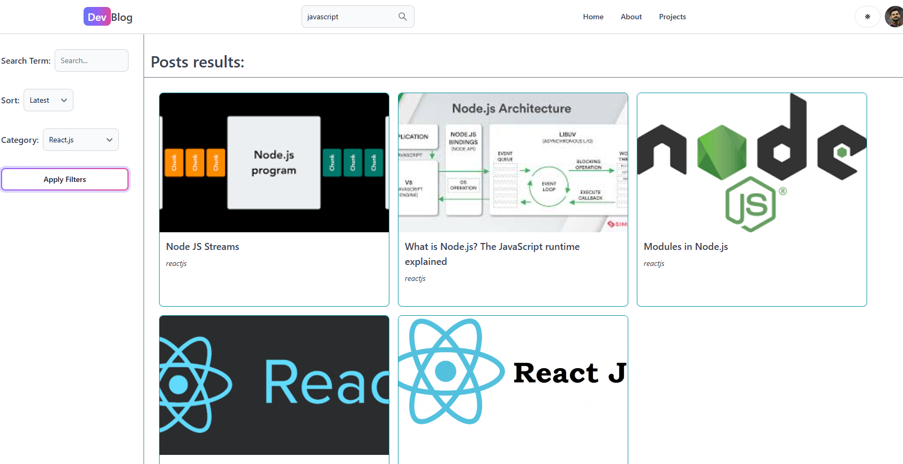

# Blogging App

## Overview
The Blogging App is a web application designed to give users a platform to create, read, update, and delete blog posts. Built with the MERN stack, this project demonstrates a modern approach to developing a full-stack application with responsive and scalable design. This app aims to make content creation easy and accessible to everyone, with a streamlined user experience for both writers and readers.

---

## Tech Stack

- **Frontend**:
  - React
  - React Router
  - Axios (for API requests)
  - Redux (for state management)
  - TailwindCSS (for styling)

- **Backend**:
  - Node.js
  - Express
  - Firebase
  - MongoDB (for data storage)
  - JWT (for user authentication)

---

## Features

- **User Authentication**:  
  Secure login and registration using JWT for authenticated access to user-specific features.

- **Create, Read, Update, Delete (CRUD) Posts**:  
  Users can create, edit, delete, and view blog posts in a rich-text editor format.

- **Commenting System**:  
  Users can leave comments on posts, encouraging community engagement.

- **Category and Tag Filters**:  
  Filter blogs based on categories or tags to make finding relevant content easier.

- **User Profiles**:  
  Users can have personal profiles where they can manage their posts and see their activity.

- **Responsive Design**:  
  Optimized for a seamless experience across desktops, tablets, and mobile devices.

---

## Screenshots


---

## How to Run Locally

1. **Clone the repository**:
   ```bash
   git clone https://github.com/shreyJS/devBlog.git
   ```
   
2. **Install dependencies and start server(root directory)**:
   ```
   npm install
   npm run start
   ```

3. **Navigate to frontend, install dependencies and start the frontend (root/client):**
   ```
   cd client
   npm install
   npm run dev
   ```

4. **Visit the browser on running port**

---

## Features coming soon...

- **Social Sharing**:  
  Enable users to share posts on social media platforms like Twitter and Facebook.

- **Notifications**:  
  Add a notification system to alert users about new comments, post interactions, and updates.

- **Post Analytics**:  
  Provide users with insights on post performance, including views, likes, shares, and comments over time. This helps authors understand their audience and improve engagement.

- **Follow system**: 
  Enable users to follow other authors, creating a personalized feed of posts from people they follow. This can improve community interaction within the app.

- **Multi-language support**: 
  Offer multi-language options so users can view and create content in their preferred language, expanding the app's accessibility to a global audience.
